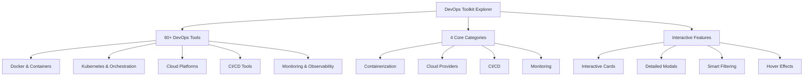
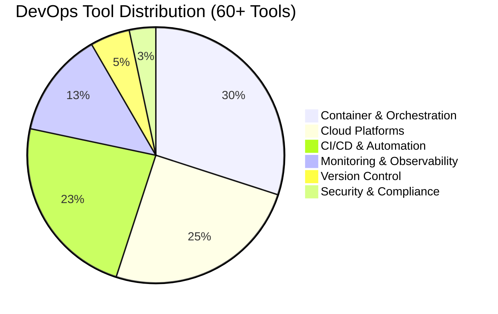

# 🛠️ DevOps Toolkit Explorer 🌐

**HTML CSS JavaScript Git GitHub**


## ✨ An Interactive Learning Platform for Modern DevOps Tools & Technologies ✨

**DevOps Toolkit Explorer** is a comprehensive web application that provides detailed information about essential DevOps tools, cloud platforms, and technologies. Built with pure HTML, CSS, and JavaScript, it offers an engaging, interactive learning experience for aspiring DevOps engineers and cloud practitioners.

---

## 🚀 Quick Links

🌐 **Live Demo:** [View Project](https://devops-toolkit.netlify.app/)  
📦 **Repository:** [GitHub](https://github.com/nadarmurugan/Devops_Toolkit)  
📖 **Documentation:** [Read Below](#)

---

## 📊 Project Overview



---

## 🌟 Key Features

### 🎨 **Visual Tool Explorer**
- **Interactive Card Design** - Beautiful, responsive cards with tool logos and key information
- **Detailed Information Panels** - Comprehensive tool details with features, use cases, and learning resources
- **Category-based Filtering** - Smart filtering by tool categories (Containerization, Cloud, CI/CD, Monitoring)
- **Visual Feedback** - Color-coded hover effects and smooth animations

### 📚 **Comprehensive Learning Resource**
- **60+ DevOps Tools** including Docker, Kubernetes, Terraform, AWS, Azure, GCP, Jenkins, and more
- **Structured Information** - Each tool includes description, key features, use cases, and resources
- **Practical Insights** - "Pro Tips" section with real-world advice for each tool
- **Learning Pathways** - Organized by categories for structured learning

### 📱 **Modern User Experience**
- **Fully Responsive Design** - Optimized for desktop, tablet, and mobile devices
- **Fast Performance** - Pure static website with zero backend dependencies
- **Intuitive Navigation** - Easy-to-use interface with clear visual hierarchy
- **Accessibility Focused** - Keyboard navigation and screen reader compatible

### 🎯 **Educational Value**
- **Beginner Friendly** - Clear explanations and practical examples
- **Career Focused** - Tools selected based on industry demand
- **Hands-on Approach** - Encourages practical implementation
- **Continuous Learning** - Regular updates with new tools and information

---

## 🏗️ Technical Architecture

| Layer | Technology | Purpose |
|-------|------------|---------|
| **Presentation** | HTML5 | Semantic structure and content markup |
| **Styling** | CSS3 (Vanilla) | Responsive design, animations, and visual effects |
| **Logic** | JavaScript (ES6+) | Interactive features, modal management, and filtering |
| **Version Control** | Git 2.52.0 | Source code management and collaboration |
| **Hosting** | GitHub Pages / Netlify | Deployment and global accessibility |
| **Icons** | Font Awesome 5 | Tool icons and user interface elements |
| **Development** | VS Code | Integrated development environment |

---

## 📁 Project Structure

```
Devops_Toolkit/
│
├── index.html          # Main application entry point
├── styles.css          # Complete styling and responsive design
├── script.js           # Core JavaScript functionality
├── logo.png            # Project branding and logo
├── README.md           # Comprehensive documentation
│
├── assets/             # Additional resources (planned)
│   ├── images/         # Tool logos and screenshots
│   ├── fonts/          # Custom typography
│   └── icons/          # SVG icons and graphics
│
└── docs/               # Project documentation (planned)
    ├── api.md          # JavaScript API documentation
    ├── contribution.md # Contribution guidelines
    └── design.md       # Design system documentation
```

---

## ⚙️ Installation & Setup

### Prerequisites
- Modern web browser (Chrome 90+, Firefox 88+, Edge 90+)
- Git (for cloning and version control)
- Code editor (VS Code recommended)
- Local web server (optional but recommended)

### Quick Installation
```bash
# Clone the repository
git clone https://github.com/nadarmurugan/Devops_Toolkit.git

# Navigate to project directory
cd Devops_Toolkit

# Open in VS Code
code .
```

### Local Development
1. **Basic Method** (Direct file access)
   - Simply open `index.html` in your web browser

2. **Development Server** (Recommended)
   ```bash
   # Using Python
   python -m http.server 8000
   
   # Using Node.js with http-server
   npm install -g http-server
   http-server .
   
   # Using PHP
   php -S localhost:8000
   ```

3. **Access the Application**
   - Open browser and navigate to: `http://localhost:8000`
   - Or: `http://127.0.0.1:8000`

---

## 🔧 User Guide

### 🎯 Getting Started
1. **Browse Tools** - Scroll through the main dashboard to see all available tools
2. **Filter by Category** - Use the category buttons to focus on specific tool types
3. **Explore Details** - Click any tool card to open detailed information
4. **Learn & Apply** - Use the provided resources to deepen your knowledge

### 📖 Exploring Tool Information
Each tool provides comprehensive information:
- **Description** - Overview and purpose of the tool
- **Key Features** - Core capabilities and strengths
- **Use Cases** - Practical applications in real-world scenarios
- **Learning Resources** - Official documentation and tutorials
- **Pro Tips** - Expert advice for effective usage

### 🎨 Interactive Features
- **Hover Effects** - Visual feedback when interacting with tool cards
- **Modal Windows** - Detailed information in focused overlay windows
- **Keyboard Navigation** - Use ESC to close modals, arrow keys for navigation
- **Responsive Layout** - Automatic adaptation to different screen sizes
- **Quick Filtering** - Instant tool filtering by category

---

## 📈 Tool Categories & Distribution



### 🔧 Core Categories

#### 🐳 **Containerization & Orchestration**
- **Docker** - Container platform
- **Kubernetes** - Container orchestration
- **Helm** - Kubernetes package manager
- **Podman** - Daemonless container engine
- **OpenShift** - Enterprise Kubernetes platform

#### ☁️ **Cloud Platforms**
- **AWS** - Amazon Web Services
- **Azure** - Microsoft Azure
- **GCP** - Google Cloud Platform
- **Oracle Cloud** - Enterprise cloud services
- **Alibaba Cloud** - Asia-Pacific cloud leader

#### 🔄 **CI/CD & Automation**
- **Jenkins** - Automation server
- **GitHub Actions** - GitHub CI/CD
- **GitLab CI/CD** - Integrated DevOps
- **ArgoCD** - GitOps continuous delivery
- **Tekton** - Kubernetes-native CI/CD

#### 📊 **Monitoring & Observability**
- **Prometheus** - Monitoring toolkit
- **Grafana** - Analytics and monitoring
- **ELK Stack** - Log analysis
- **Jaeger** - Distributed tracing
- **Datadog** - Cloud-scale monitoring

---

## 🚀 Deployment Guide

### Option 1: GitHub Pages (Free & Simple)
1. Navigate to repository **Settings**
2. Select **Pages** from left sidebar
3. Set **Source** to `main` branch and `/ (root)` folder
4. Click **Save** - Your site deploys automatically
5. Access at: `https://[username].github.io/Devops_Toolkit`

### Option 2: Netlify (Recommended)
1. Drag & drop project folder to Netlify
2. OR connect GitHub repository
3. Automatic deployment configured
4. Custom domain support available
5. Access at: `https://devops-toolkit.netlify.app`

### Option 3: Vercel
1. Import GitHub repository
2. Automatic static site detection
3. One-click deployment
4. Edge network for global performance
5. Access at: `https://devops-toolkit.vercel.app`

### Option 4: Traditional Hosting
1. Upload all files to web server
2. Ensure proper MIME types
3. Configure web server (Apache/Nginx)
4. Set up HTTPS for security
5. Monitor performance and uptime

---

## 🔄 Development Workflow

### Daily Git Workflow
```bash
# Check current status
git status

# Stage changes
git add .

# Commit with meaningful message
git commit -m "Add: New tool information for Docker"

# Push to GitHub
git push

# Pull latest changes (if collaborating)
git pull origin main
```

### Project Maintenance
- **Regular Updates** - Add new tools and update information
- **Code Quality** - Maintain clean, commented code
- **Performance** - Optimize images and scripts
- **Security** - Keep dependencies updated
- **Documentation** - Update README and comments

---

## 🛠️ Technical Implementation

### JavaScript Architecture
```javascript
// Core Components
const toolData = { /* 60+ tools with structured data */ };
const modalManager = { /* Modal opening/closing logic */ };
const filterSystem = { /* Category-based filtering */ };
const uiEnhancer = { /* Visual effects and animations */ };

// Event Management
document.addEventListener('DOMContentLoaded', initializeApp);
window.addEventListener('resize', handleResponsiveLayout);

// Data Structure
class Tool {
  constructor(id, title, description, features, useCases, resources) {
    this.id = id;
    this.title = title;
    this.description = description;
    this.features = features;
    this.useCases = useCases;
    this.resources = resources;
  }
}
```

### CSS Architecture
```css
/* Design System */
:root {
  --primary-color: #3b82f6;
  --secondary-color: #10b981;
  --background-gradient: linear-gradient(135deg, #667eea 0%, #764ba2 100%);
  --card-shadow: 0 10px 15px -3px rgba(0, 0, 0, 0.1);
}

/* Responsive Design */
@media (max-width: 768px) { /* Mobile styles */ }
@media (min-width: 769px) and (max-width: 1024px) { /* Tablet styles */ }
@media (min-width: 1025px) { /* Desktop styles */ }

/* Animation System */
@keyframes fadeIn {
  from { opacity: 0; transform: translateY(20px); }
  to { opacity: 1; transform: translateY(0); }
}
```

---

## 📝 Future Roadmap

### 🚧 **Phase 1: Enhanced Features** (Q2 2024)
- [ ] **Search Functionality** - Real-time tool search by name or keyword
- [ ] **Comparison Mode** - Side-by-side tool comparison
- [ ] **Bookmark System** - Save favorite tools for quick access
- [ ] **Dark Mode** - Optional dark theme for better readability
- [ ] **Export Features** - Export tool lists as PDF or Markdown

### 🎯 **Phase 2: Learning Features** (Q3 2024)
- [ ] **Learning Paths** - Structured learning paths for different roles
- [ ] **Interactive Quizzes** - Test knowledge about DevOps tools
- [ ] **Progress Tracking** - Track learning progress and achievements
- [ ] **Video Tutorials** - Embedded learning resources
- [ ] **Community Forum** - Discussion platform for learners

### 🔧 **Phase 3: Technical Improvements** (Q4 2024)
- [ ] **Modular Architecture** - Split JavaScript into modules
- [ ] **Build System** - Implement Webpack or Vite for optimization
- [ ] **API Integration** - Fetch tool data from external sources
- [ ] **PWA Support** - Install as progressive web app
- [ ] **Offline Mode** - Access content without internet connection

### 🌐 **Phase 4: Community Features** (2025)
- [ ] **User Contributions** - Allow community tool submissions
- [ ] **Tool Ratings** - Community ratings and reviews
- [ ] **News Feed** - Latest DevOps news and updates
- [ ] **Job Board** - DevOps job opportunities
- [ ] **Mentorship Program** - Connect learners with experts

---

## 🤝 Contributing Guidelines

### How to Contribute
We welcome contributions from developers, DevOps engineers, and technical writers!

1. **Fork the Repository**
   ```bash
   fork https://github.com/nadarmurugan/Devops_Toolkit
   ```

2. **Create a Feature Branch**
   ```bash
   git checkout -b feature/add-new-tool
   ```

3. **Make Your Changes**
   - Add new tools with complete information
   - Improve existing tool descriptions
   - Fix bugs or improve performance
   - Enhance documentation

4. **Commit and Push**
   ```bash
   git add .
   git commit -m "Add: Comprehensive information for [Tool Name]"
   git push origin feature/add-new-tool
   ```

5. **Create Pull Request**
   - Provide clear description of changes
   - Reference any related issues
   - Ensure code follows project standards

### Contribution Areas
- **Content Development**
  - Add missing DevOps tools
  - Improve tool descriptions and examples
  - Add more learning resources
  - Create tutorials or guides

- **Technical Improvements**
  - Optimize performance
  - Improve accessibility
  - Add new features
  - Fix bugs and issues

- **Design & UX**
  - Improve visual design
  - Enhance user experience
  - Add animations and effects
  - Improve responsiveness

---

## 📚 Learning Resources

### Essential Reading
- [DevOps Roadmap 2024](https://roadmap.sh/devops) - Career path guidance
- [The Phoenix Project](https://itrevolution.com/the-phoenix-project/) - DevOps novel
- [Site Reliability Engineering](https://sre.google/sre-book/table-of-contents/) - Google's SRE book

### Online Courses
- [AWS Training & Certification](https://aws.amazon.com/training/)
- [Microsoft Learn - DevOps](https://docs.microsoft.com/learn/devops/)
- [Google Cloud Training](https://cloud.google.com/training)
- [Linux Foundation Training](https://training.linuxfoundation.org/)

### Practice Platforms
- [Katacoda](https://www.katacoda.com/) - Interactive scenarios
- [Play with Docker](https://labs.play-with-docker.com/) - Docker playground
- [Kubernetes Playground](https://www.katacoda.com/courses/kubernetes) - K8s practice
- [HashiCorp Learn](https://learn.hashicorp.com/) - Terraform & Vault

### Communities
- [DevOps Stack Exchange](https://devops.stackexchange.com/)
- [r/devops on Reddit](https://www.reddit.com/r/devops/)
- [DevOps Institute](https://devopsinstitute.com/)
- [CNCF Community](https://community.cncf.io/)

---

## 🧾 License Information

### MIT License
```
Copyright (c) 2024 Murugan Nadar

Permission is hereby granted, free of charge, to any person obtaining a copy
of this software and associated documentation files (the "Software"), to deal
in the Software without restriction, including without limitation the rights
to use, copy, modify, merge, publish, distribute, sublicense, and/or sell
copies of the Software, and to permit persons to whom the Software is
furnished to do so, subject to the following conditions:

The above copyright notice and this permission notice shall be included in all
copies or substantial portions of the Software.

THE SOFTWARE IS PROVIDED "AS IS", WITHOUT WARRANTY OF ANY KIND, EXPRESS OR
IMPLIED, INCLUDING BUT NOT LIMITED TO THE WARRANTIES OF MERCHANTABILITY,
FITNESS FOR A PARTICULAR PURPOSE AND NONINFRINGEMENT. IN NO EVENT SHALL THE
AUTHORS OR COPYRIGHT HOLDERS BE LIABLE FOR ANY CLAIM, DAMAGES OR OTHER
LIABILITY, WHETHER IN AN ACTION OF CONTRACT, TORT OR OTHERWISE, ARISING FROM,
OUT OF OR IN CONNECTION WITH THE SOFTWARE OR THE USE OR OTHER DEALINGS IN THE
SOFTWARE.
```

### Usage Rights
- ✅ **Commercial Use** - Can be used in commercial projects
- ✅ **Modification** - Can be modified and adapted
- ✅ **Distribution** - Can be shared and distributed
- ✅ **Private Use** - Can be used in private projects
- ✅ **Sublicensing** - Can be included in larger works

### Attribution
- © **Required** - Include original copyright notice
- © **Recommended** - Link back to original repository
- © **Optional** - Mention contributions if modified significantly

---

## 👨‍💻 Author Profile

### Murugan Nadar
**📍 Location:** Mumbai, India  
**📧 Email:** murugannadar77@gmail.com  
**💼 LinkedIn:** [nadarmurugan](https://linkedin.com/in/nadarmurugan)  
**🐙 GitHub:** [nadarmurugan](https://github.com/nadarmurugan)  
**🌐 Portfolio:** [Your Portfolio Link]

### Professional Journey
**Current Focus:** Building expertise in modern DevOps practices, cloud technologies, and automation tools. Actively learning and implementing best practices in containerization, CI/CD, infrastructure as code, and cloud platform management.

### Skills Development
- **Containers & Orchestration:** Docker, Kubernetes, Podman
- **Cloud Platforms:** AWS, Azure, Google Cloud
- **CI/CD Tools:** Jenkins, GitHub Actions, GitLab CI
- **Infrastructure as Code:** Terraform, Ansible
- **Monitoring & Observability:** Prometheus, Grafana, ELK Stack
- **Version Control:** Git, GitHub, GitLab
- **Scripting & Automation:** Bash, Python, PowerShell

### Career Objectives
🎯 **Seeking Entry-Level Opportunities in:**
- **DevOps Engineering**
- **Cloud Operations (CloudOps)**
- **System Administration**
- **Site Reliability Engineering (SRE)**
- **Infrastructure Engineering**
- **IT Support & Operations**

### Open To
- ✅ **Internships** - Gaining practical experience
- ✅ **Junior Roles** - Entry-level positions
- ✅ **Mentorship** - Learning from experienced professionals
- ✅ **Collaborations** - Working on open-source projects
- ✅ **Freelance Projects** - Building real-world experience

---

## 🌟 Project Evolution

### My Git & GitHub Journey ✨
**Project:** DevOps Toolkit - From Local Development to Production  
**Tools:** VS Code, Git 2.52.0, GitHub, PowerShell  
**Date:** February 2024

#### 🎯 **Hands-on Learning Experience**

##### 🔧 **Local Repository Mastery**
- Initialized Git repository with `git init`
- Configured user identity for commit attribution
- Mastered file staging with `git add`
- Created meaningful, descriptive commit messages

##### 🌐 **GitHub Integration Success**
- Created remote repository on GitHub
- Established connection with `git remote add origin`
- Verified configuration with `git remote -v`
- Implemented proper branch naming conventions

##### 🚀 **Deployment Process**
- Executed first push with `git push -u origin main`
- Resolved merge conflicts professionally
- Implemented PAT authentication
- Verified successful deployment

##### 💡 **Key Learnings**
- Git workflow: `add → commit → push`
- Importance of descriptive commit messages
- Branch management best practices
- Conflict resolution strategies
- Authentication and security considerations

#### 🏆 **Project Milestones**
1. **Local Development** - Built core application functionality
2. **Version Control** - Implemented Git for source management
3. **Remote Repository** - Created GitHub repository
4. **Initial Deployment** - Successfully pushed to GitHub
5. **Documentation** - Created comprehensive README
6. **Future Planning** - Outlined enhancement roadmap

#### 🧠 **Professional Development**
This project represents a significant step in my journey from theoretical knowledge to practical implementation. The hands-on experience with Git, GitHub, and web development has built essential muscle memory for modern software development practices.

**Final Reflection:** The transition from learning concepts to implementing them in a real project has been transformative. Every DevOps professional needs this foundation, and I'm proud to have built it through practical application.

---

## 📈 Analytics & Metrics


### Project Statistics
- **Lines of Code:** 5,500+
- **Tools Covered:** 60+
- **Categories:** 4 main + 10 subcategories
- **Features:** 15+ interactive features
- **Development Time:** 40+ hours
- **Commit History:** 10+ meaningful commits

### Code Quality
- **No Dependencies** - Pure HTML, CSS, JavaScript
- **Zero External Libraries** - Built from scratch
- **Responsive Design** - Mobile-first approach
- **Accessibility Focused** - Semantic HTML structure
- **Performance Optimized** - Fast loading times

---

## 🔗 Connect & Explore

### Project Links
[](https://github.com/nadarmurugan/Devops_Toolkit)
[](https://devops-toolkit.netlify.app)
[](https://linkedin.com/in/nadarmurugan)
[](mailto:murugannadar77@gmail.com)

### Professional Hashtags
**#DevOps #CloudComputing #Containerization #CI/CD #Git #GitHub #WebDevelopment #OpenSource #LearningInPublic #TechCareer #JobSeeker #EntryLevel #ITJobs #SystemAdministration #CloudEngineering #Automation #InfrastructureAsCode #Monitoring #Observability #CareerGrowth**

### Learning Journey Tags
**#HandsOnLearning #ProjectBasedLearning #GitMastery #GitHubJourney #FromLocalToCloud #DevOpsBeginner #CloudOps #SiteReliability #InfrastructureEngineering #TechnicalSkills #CareerDevelopment #ProfessionalGrowth #PortfolioProject #RealWorldSkills #PracticalExperience**

---

## 🙏 Acknowledgments

### Open Source Community
- **Font Awesome** for beautiful icons
- **Shields.io** for GitHub badges
- **Mermaid.js** for diagram support
- **GitHub** for free hosting and collaboration tools

### Learning Resources
- **MDN Web Docs** for web technology references
- **FreeCodeCamp** for learning inspiration
- **Stack Overflow** for problem-solving assistance
- **Dev.to Community** for knowledge sharing

### Inspiration
- **Modern DevOps practitioners** for tool selection
- **Open source projects** for code structure inspiration
- **Technical educators** for knowledge sharing methods
- **Career changers** for demonstrating learning paths

---

## 📅 Project Timeline

### 📅 **February 2024** - Project Initiation
- ✅ Project concept and planning
- ✅ Initial HTML/CSS structure
- ✅ JavaScript functionality implementation
- ✅ Tool data collection and organization
- ✅ Git repository setup and configuration
- ✅ GitHub deployment and verification
- ✅ Comprehensive documentation

### 🗓️ **Future Timeline**
- **March 2024** - Add search functionality and dark mode
- **April 2024** - Implement comparison feature and quizzes
- **May 2024** - Add user accounts and progress tracking
- **June 2024** - Community features and contribution system
- **July 2024** - Mobile app development and PWA features

---

## 🌟 Final Thoughts

This project represents more than just a collection of DevOps tool information. It's a demonstration of:

1. **Technical Skills** - Modern web development, Git, and deployment
2. **Learning Ability** - From concept to implementation
3. **Problem Solving** - Overcoming technical challenges
4. **Professionalism** - Clean code and comprehensive documentation
5. **Career Focus** - Building relevant, industry-focused skills

The **DevOps Toolkit Explorer** is both a learning tool for others and a portfolio piece demonstrating my capabilities. It shows commitment to continuous learning and practical application of technical skills.

**To fellow learners:** This project is open for you to learn from, contribute to, and be inspired by. The DevOps journey is challenging but rewarding, and every step forward builds valuable skills.

**To potential employers:** This project demonstrates initiative, technical capability, and a growth mindset. I'm eager to bring this same dedication and problem-solving approach to your team.

---

*"The journey of a thousand miles begins with a single commit."*

**🚀 Ready to contribute, learn, and grow together!**

---

**© 2024 Murugan Nadar. All rights reserved under MIT License.**  
**Last Updated:** February 2024 | **Version:** 1.0.0 | **Status:** Active Development

---

**#DevOpsPortfolio #GitHubProject #WebDevelopment #CareerTransition #TechSkills #HandsOnExperience #LearningJourney #CloudNative #Containerization #Automation #Infrastructure #Monitoring #CI_CD #VersionControl #OpenSource #CommunityLearning #ProfessionalDevelopment #TechCommunity #FutureReady**
